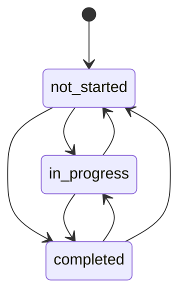
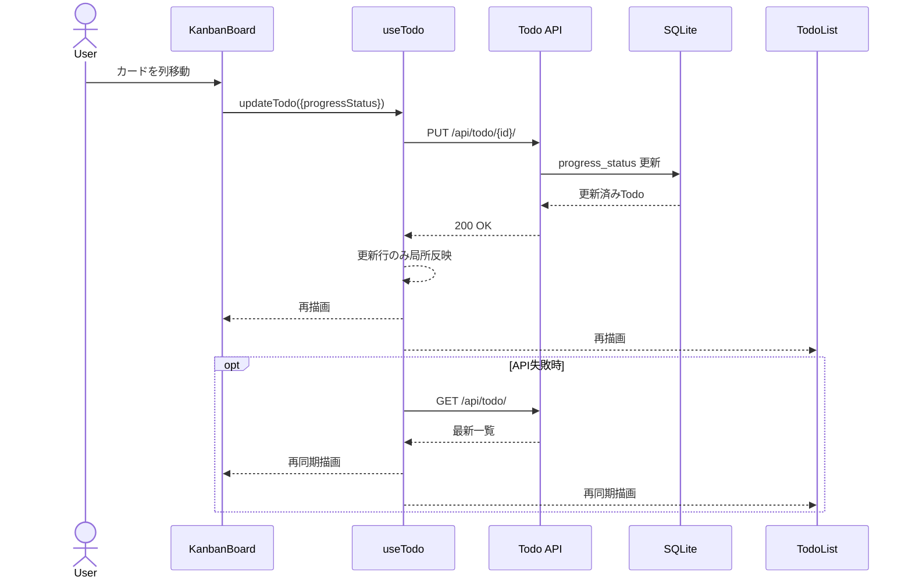

# Design: タスク進捗カンバンボード

## 0. ドキュメント情報

- 対象Spec: `docs/specs/008_task_progress_kanban_board/spec.md`
- 作成日: 2026-02-15
- 更新日: 2026-02-15
- スコープ: `both`（backend + frontend）
- 設計方針: `progress_status` 単一管理（`is_completed` / `isCompleted` は削除）

## 1. Baseline（Spec固定）

### 1.1 Goal

タスク進捗を「着手前・進行中・完了」の3状態で可視化し、一覧表示とカンバン表示のどちらでも一貫した状態管理を可能にする。

### 1.2 Non-goals

- 工数見積もり/バーンダウン/ガントチャート
- AIによる進捗自動判定
- 複数ユーザー同時編集
- 任意列カスタマイズ

### 1.3 要件チェックリスト

| ID | 種別 | 要件 | 優先度 |
| --- | --- | --- | --- |
| FR-001 | Functional | 各タスクは3状態のいずれか1つを保持 | MUST |
| FR-002 | Functional | カンバン表示で3列を提供 | MUST |
| FR-003 | Functional | 列移動で進捗状態を更新 | MUST |
| FR-004 | Functional | 一覧表示とカンバン表示で状態一貫 | MUST |
| FR-005 | Functional | 再表示後も状態を保持 | MUST |
| FR-006 | Functional | 既存の完了ステータス意味と不一致を発生させない | SHOULD |
| NFR-001 | Non-functional | 更新操作で知覚遅延を発生させない | SHOULD |
| NFR-002 | Non-functional | 表示切替後もデータ不整合を発生させない | MUST |

## 2. 現状実装コンテキスト（抜粋）

- Backendは `is_completed` の2値モデルで実装されている
- Frontendは `isCompleted` を前提に一覧UI・API payloadを構成している
- SQLite運用は手動migration script方式の実績がある
- 今回は後方互換を持たず、`progress_status` へ完全移行する

## 3. 設計方針比較（必須）

### 3.1 案A: `progress_status` 単一管理へ完全移行（採用）

- 概要:
  - DB/API/UIの進捗表現を `progress_status` / `progressStatus` に統一
  - `is_completed` / `isCompleted` は削除
- 採用理由:
  - 状態の単一責務化で整合性が高い
  - 同期ロジック不要で保守性が高い
  - FR-004 / NFR-002 に対して一貫性担保が容易

### 3.2 案B: `is_completed` 互換維持の段階移行（不採用）

- 不採用理由:
  - 二重状態管理が必要になり不整合リスクが増える
  - 削除時期を後ろ倒ししやすく技術負債化する

### 3.3 案C: 2フラグ（完了/進行中）で3状態表現（不採用）

- 不採用理由:
  - 不正な状態組み合わせを持ち込みやすい
  - バリデーションとクエリが複雑化する

## 4. 採用設計詳細（案A）

### 4.1 ドメインモデル

- 進捗状態:
  - `not_started`
  - `in_progress`
  - `completed`
- 進捗は `progress_status` のみで管理する

### 4.2 API設計

### GET `/api/todo/`

- 受け付ける状態条件:
  - `progress_status=not_started|in_progress|completed`
- 削除:
  - `status=completed|incomplete` は廃止

### POST `/api/todo/`

- 受け付ける進捗:
  - `progressStatus`（省略時は `not_started`）
- 削除:
  - `isCompleted` は受け付けない

### PUT `/api/todo/{id}/`

- 受け付ける進捗:
  - `progressStatus`
- 削除:
  - `isCompleted` は受け付けない

### レスポンス

- `progressStatus` を返す
- `isCompleted` は返さない

### 4.3 UI設計

- `DashboardPage` に一覧/カンバン切替を追加
- 一覧とカンバンは同一 `todos` 状態を参照
- 一覧編集フォームは `progressStatus` を直接編集可能にする
- カンバンの列移動は `progressStatus` 更新としてPUT送信する
- 更新成功時は更新対象行を局所反映し、失敗時のみ再取得する

### 4.4 バリデーション設計

- Backend:
  - `progress_status` は許可値以外422
  - `is_completed` / `isCompleted` は不明フィールドとして拒否
- Frontend:
  - `Todo` 型から `isCompleted` を削除
  - DnDの不正遷移入力は無視

### 4.5 例外/エラー設計

- APIエラー形式は現行準拠
- DnD失敗時:
  - エラー通知
  - `fetchTodos` による再同期

### 4.6 性能/整合性

- NFR-001:
  - 1操作1PUT
  - 成功時は局所反映で不要GETを抑制
- NFR-002:
  - 表示モード切替は同一状態ソースを参照
  - 失敗時再同期で最終整合を担保

## 5. UML（必須）

### 5.1 図の選定理由

- 状態遷移図で進捗モデルの妥当性を確認する
- シーケンス図でUI操作から永続化までの整合性を確認する

### 5.2 状態遷移図（Mermaid）

### 5.3 シーケンス図（Mermaid）

## 6. スキーマ設計（必須）

### 6.1 変更対象テーブル

- `todos`

### 6.2 カラム変更

| 区分 | カラム | 内容 |
| --- | --- | --- |
| 追加 | `progress_status` | `VARCHAR(20) NOT NULL DEFAULT 'not_started'` |
| 削除 | `is_completed` | 本移行で削除 |

### 6.3 制約・インデックス

- CHECK制約:
  - `progress_status IN ('not_started','in_progress','completed')`
- 部分一意インデックス:
  - `owner_id + name`
  - 条件 `progress_status != 'completed'`
- 追加インデックス:
  - `ix_todo_owner_progress_status_created_at`

### 6.4 マイグレーション方針（本番反映前に実施）

- 実装対象:
  - `backend/prisma/schema.prisma`
  - `backend/docs/ARCHITECTURE.md`
- 実施内容:
  - DBバックアップ作成
  - `todos` を新スキーマ（`is_completed` なし）で再作成
  - 既存データを変換コピー
    - `is_completed = 1` -> `progress_status = 'completed'`
    - `is_completed = 0` -> `progress_status = 'not_started'`
  - 旧インデックス削除と新インデックス再作成
  - 移行後検証クエリ実行（件数一致、不正値ゼロ）
- ロールバック:
  - バックアップDBへ差し戻し

## 7. 影響範囲（ファイル単位）

### 7.1 Backend（変更）

- `backend/src/domain/todo/types.ts`
- `backend/src/http/todo/schemas.ts`
- `backend/src/infra/todo/prisma-todo-repo-port.ts`
- `backend/src/usecases/todo/write-todos.ts`
- `backend/src/http/todo/routes.ts`

### 7.2 Backend（追加）

- `backend/prisma/schema.prisma`
- `backend/docs/ARCHITECTURE.md`
- `backend/tests/todo.test.ts`
- `backend/tests/prisma-testing.test.ts`

### 7.3 Frontend（変更）

- `frontend/src/models/todo.ts`
- `frontend/src/hooks/useTodo.ts`
- `frontend/src/pages/DashboardPage.tsx`
- `frontend/src/components/todo/TodoList.tsx`
- `frontend/src/components/todo/TodoSearchControls.tsx`

### 7.4 Frontend（追加）

- `frontend/src/components/todo/TodoKanbanBoard.tsx`
- `frontend/tests/components/TodoKanbanBoard.test.tsx`
- `frontend/tests/pages/DashboardPage.kanban.test.tsx`
- `frontend/tests/fixtures/api/todo/*.json`

## 8. テスト設計

### 8.1 Backend

- `progressStatus` での作成/更新/取得
- `progress_status` フィルタ
- `completed` 遷移時の繰り返しタスク生成継続
- `isCompleted` / `is_completed` がAPIに存在しないこと
- migration scriptの変換・削除・冪等性

### 8.2 Frontend

- カンバン3列表示と列移動PUT
- 一覧/カンバン切替後の状態一致
- 一覧編集で `progressStatus` を変更可能
- `isCompleted` 非依存への回帰確認

## 9. 要件トレース（FR/NFR -> 設計 -> タスク）

| 要件ID | 設計要素 | 主検証 |
| --- | --- | --- |
| FR-001 | `progress_status` 単一管理 | backend progress status tests |
| FR-002 | カンバン3列 | frontend kanban component tests |
| FR-003 | 列移動でPUT更新 | dashboard kanban integration tests |
| FR-004 | 単一 `todos` 状態で表示切替 | list/kanban consistency tests |
| FR-005 | DB永続化 + 再表示確認 | API + UI reload tests |
| FR-006 | 移行時に完了意味を保持 | migration mapping tests |
| NFR-001 | 局所反映 + 1操作1PUT | request log tests |
| NFR-002 | 失敗時再同期 + 単一ソース | consistency tests |

## 10. 決定済み事項

1. カンバン列内の並び順は `created_at desc` 固定で実装する
2. DnDのキーボード操作は初期リリース範囲に含めない

## 11. 最終整合チェック

| 要件ID | 設計済み | 状態 |
| --- | --- | --- |
| FR-001 | 済 | 確定 |
| FR-002 | 済 | 確定 |
| FR-003 | 済 | 確定 |
| FR-004 | 済 | 確定 |
| FR-005 | 済 | 確定 |
| FR-006 | 済 | 確定 |
| NFR-001 | 済 | 確定 |
| NFR-002 | 済 | 確定 |

