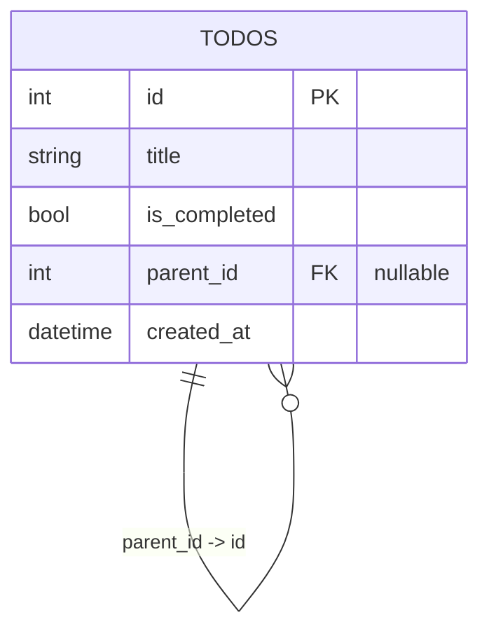
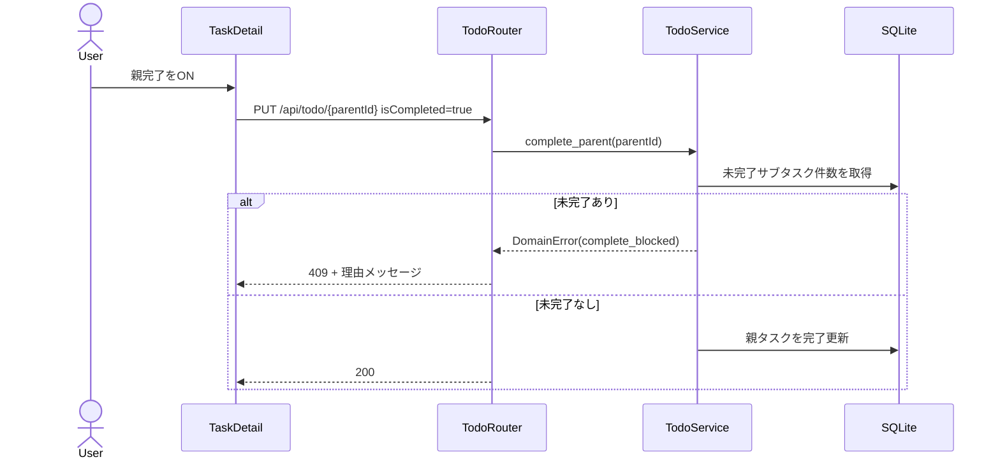

# Design: サブタスク作成機能

## 0. ドキュメント情報

- 対象Spec: `docs/specs/009_subtask_creation/spec.md`
- 作成日: 2026-02-19
- 更新日: 2026-02-21
- スコープ: both（backend + frontend）
- 設計原則: 親子整合性をDB制約で担保し、業務制約（親完了条件）をusecases層で一元化する

## 1. Baseline（Spec固定）

### 1.1 Goal

親タスク配下にサブタスクを作成・管理できるようにし、作業分解と進捗把握を一貫して行える状態を実現する。

### 1.2 Non-goals

- サブタスクの多階層化
- サブタスク間の依存関係管理
- AIによるサブタスク自動生成
- サブタスクの手動並び替え

### 1.3 要件チェックリスト

| ID | 種別 | 要件 | 優先度 |
| --- | --- | --- | --- |
| FR-001 | Functional | サブタスクは必ず1つの親タスク参照を保持 | MUST |
| FR-002 | Functional | 親タスク詳細からサブタスク作成可能 | MUST |
| FR-003 | Functional | サブタスク表示時に親タスク情報を表示 | MUST |
| FR-004 | Functional | 親タスク詳細で紐づくサブタスク一覧を表示 | MUST |
| FR-005 | Functional | 進捗を「完了数/総数 + %」で表示 | MUST |
| FR-006 | Functional | サブタスク完了状態変更時に進捗再計算 | MUST |
| FR-007 | Functional | サブタスク0件時は `0/0 (0%)` 表示 | MUST |
| FR-008 | Functional | サブタスクあり親は全件完了時のみ完了可能 | MUST |
| FR-009 | Functional | 親削除時にサブタスク同時削除 | MUST |
| FR-010 | Functional | 親完了拒否時に理由を明示 | MUST |
| NFR-001 | Non-functional | 親詳細表示で知覚遅延を発生させない | SHOULD |
| NFR-002 | Non-functional | 親子参照整合性を維持し孤立データを防止 | MUST |
| NFR-003 | Non-functional | 進捗表示の視認性を維持 | SHOULD |

## 2. 実装コンテキスト

- BackendはTypeScript + Hono + Prisma + SQLiteでレイヤード構成（http -> usecases -> ports/infra）。
- FrontendはReact + TypeScriptで、`models`（ドメイン）と`services`（外部連携）を分離する構成。
- 現状Todoは単体完了制御のみで、親子関連を持たない。

## 3. 設計方針比較

### 3.1 案A: `todos` 自己参照（採用）

- 概要:
  - `todos.parent_id`（nullable FK）を追加し親子関係を表現。
  - 親進捗は `WHERE parent_id = :parent_id` の集計で算出。
- 採用理由:
  - 既存CRUDに最小差分で統合できる。
  - FR-001/FR-009/NFR-002 をDB制約で直接担保できる。
  - API/UIの型拡張が単純。

### 3.2 案B: `subtasks` 別テーブル（不採用）

- 不採用理由:
  - Task/Subtaskの二重モデル・二重APIが必要で実装負荷が高い。
  - 一覧・検索・更新で重複実装が増える。

### 3.3 案C: 親タスクにJSON内包（不採用）

- 不採用理由:
  - 部分更新・整合性担保・集計性能が悪化しやすい。
  - NFR-001/NFR-002に不利。

## 4. 採用設計（案A）

### 4.1 データ/ドメイン設計

- Todo（親子共通）
  - `id`, `title`, `is_completed`, `parent_id`, `created_at`
- ルール
  - `parent_id IS NULL` を親タスクとして扱う。
  - `parent_id IS NOT NULL` をサブタスクとして扱う。
  - 親の親を禁止（多階層化禁止）。

### 4.2 API設計

#### POST `/api/todo/`

- request 追加:
  - `parentId?: number`
- validation:
  - `parentId` 指定時に親存在確認
  - 親がサブタスクなら 409（多階層禁止）
  - title空/空白のみは 422

#### GET `/api/todo/`

- response 追加:
  - `parentId`
  - `parentTitle`（サブタスクのみ）
- query拡張:
  - `parentId=<id>` で子一覧取得
  - 親詳細表示用に進捗集計データ（completedCount/totalCount/progressPercent）を返却

#### PUT `/api/todo/{id}/`

- 親完了時の業務制約:
  - `isCompleted=true` かつ未完了サブタスク存在時は `409 Conflict`
  - エラー詳細に拒否理由を明示（FR-010）

#### DELETE `/api/todo/{id}/`

- 親削除時:
  - FK `ON DELETE CASCADE` でサブタスク同時削除

### 4.3 UI設計

- 親タスク詳細画面に以下を追加:
  - サブタスク作成フォーム
  - サブタスク一覧
  - 進捗表示 `x/y (z%)`
- 一覧画面でサブタスクには親タスク名または親詳細導線を表示。
- 親完了操作が409で失敗した場合、拒否理由をトースト/インライン表示。

### 4.4 バリデーション/例外設計

- backend
  - 親不存在: 404（参照先リソース不存在）
  - 親完了拒否: 409 + `未完了のサブタスクがあるため完了できません`
  - 多階層作成: 409 + `サブタスクを親として指定できません`
  - サブタスクへの繰り返し設定: 409 + `サブタスクには繰り返し設定できません`
  - title空/空白のみ: 422（入力値バリデーション）
- frontend
  - 空文字送信防止（UI入力バリデーション）
  - APIエラーはユーザー可読文言で表示

### 4.5 性能・整合性設計

- `parent_id` indexで子一覧/集計クエリを高速化。
- 進捗は集計関数化し、作成/更新/削除後に同一ロジックで再計算。
- 親削除時はDBカスケードを主系にして孤立データを防止。
- 繰り返し親タスクの次回生成は親タスク本体のみ複製し、サブタスクは複製しない（次回タスクは子0件開始）。

### 4.6 HTTPステータス設計ポリシー

- 422 Unprocessable Content:
  - 入力値そのものが不正（型・必須・空文字など）
- 409 Conflict:
  - 入力値は妥当だが、現在のリソース状態/ドメイン不変条件と衝突
  - 例: 親がサブタスク（多階層禁止）、未完了サブタスクがある親完了
- 404 Not Found:
  - 参照対象リソースが存在しない

## 5. UML

### 5.1 図の選定理由

- ER図: 親子参照制約と削除カスケードを明示するため。
- シーケンス図: 親完了拒否（業務制約）の実行順をレビュー可能にするため。

### 5.2 ER図（Mermaid）

### 5.3 シーケンス図（Mermaid）

## 6. スキーマ設計

### 6.1 変更対象テーブル

- `todos`

### 6.2 追加/変更カラム

| カラム | 型 | NULL | default | 備考 |
| --- | --- | --- | --- | --- |
| `parent_id` | INTEGER | 可 | NULL | `REFERENCES todos(id) ON DELETE CASCADE` |

### 6.3 制約・インデックス

- 外部キー: `FOREIGN KEY(parent_id) REFERENCES todos(id) ON DELETE CASCADE`
- インデックス: `CREATE INDEX idx_todos_parent_id ON todos(parent_id)`
  - 主用途（1親に紐づく複数子の一覧・進捗集計）で `WHERE parent_id = ?` が多発するため必須とする。
- アプリ制約:
  - `id == parent_id` 禁止
  - 親がサブタスクである設定禁止（多階層禁止）

### 6.4 既存データ影響とマイグレーション方針

- 既存レコードは `parent_id = NULL` として親タスク扱い。
- 本機能は**後方互換を前提にしない**ため、データベースは最終スキーマへ一括移行する（中間互換状態を作らない）。
- マイグレーションは「一時テーブル作成 -> データ再投入 -> 旧テーブル置換」で実施し、最終制約（FK + index + 必要なNOT NULL）を一度で確定させる。
- 失敗時はロールバックではなくDBを再作成して再適用する運用を基本とする。

## 7. テスト設計（t_wada TDD）

- Red: 受け入れ条件を満たす失敗テストを先に追加
- Green: 最小実装で通す
- Refactor: クエリ・重複ロジックを整理

### 7.1 Backend

- 親付きサブタスク作成成功
- 親不存在/多階層/空タイトル拒否
- 親完了拒否（409）
- 親削除で子が同時削除
- 進捗 `0/0 (0%)` と再計算

### 7.2 Frontend

- サブタスク作成フォームの動作
- 親詳細で進捗表示
- 親完了拒否メッセージ表示
- サブタスクで親情報表示

## 8. 影響範囲

- backend
  - model/repository/service/router/schema/tests/migration script
- frontend
  - models/services/pages/components/tests
- docs
  - spec関連設計/計画/レビュー文書

## 9. 要件トレース（要件ID -> 設計要素）

| 要件ID | 設計要素 |
| --- | --- |
| FR-001 | `parent_id` FK + 作成時親存在チェック |
| FR-002 | 親詳細のサブタスク作成フォーム + POST `parentId` |
| FR-003 | `parentTitle` 返却とUI表示 |
| FR-004 | 親詳細で `parentId` フィルタ子一覧表示 |
| FR-005 | 集計値 `completed/total/%` の返却と表示 |
| FR-006 | サブタスク更新/作成/削除後の再計算 |
| FR-007 | total=0時 `0/0 (0%)` 固定 |
| FR-008 | 親完了時の未完了子チェック（409） |
| FR-009 | FK `ON DELETE CASCADE` |
| FR-010 | 409エラー本文に拒否理由を設定 |
| FR-011 | サブタスクの繰り返し設定禁止（作成/更新時409） |
| FR-012 | 繰り返し次回生成時にサブタスク非複製 |
| NFR-001 | `parent_id` index + 単純集計クエリ |
| NFR-002 | FK制約 + カスケード削除 |
| NFR-003 | 進捗の分数/%併記 |

## 10. 非互換前提での最終設計ポリシー

- 旧API契約との互換は持たず、サブタスク対応後のレスポンス/バリデーションを正とする。
- 移行期間用の暫定フィールド・暫定エンドポイントは作らない。
- 実装は「最終形のドメインモデル」を直接実現し、移行コードを最小化する。

## 11. Open Questions

- 親タスク情報の表示形式は「名称のみ」か「名称 + 詳細リンク」かをUI文言/導線ガイドラインに合わせて最終確定する。
